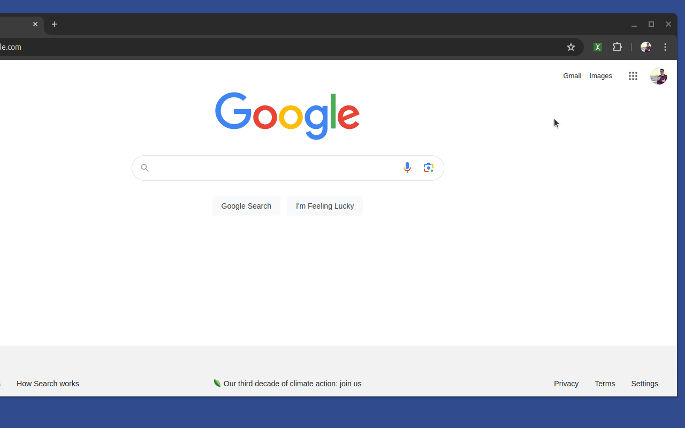

# [Profile Jumper!](https://profilejumper.com) 
Jump easily between your profiles.

## Chrome Browser Extension
This is a Chrome Browser Extension to allow you to have all your most frequent used links in one place.

Instead of having browser bookmark links for most frequent used links.
You can used this for other contexts too e.g. One browser can be for personal use, the other for business but they have different profile links.

You can use this for any link (it does not only need to be for a social profile). I link to my Google Drive or latest relevant project or even monthly utility websites. It's up to you how you would like to use this. 

See [Chrome Browser Extension](https://chromewebstore.google.com/detail/profile-jumper/fgjjcaimpepmohgbbeaooecldlknlkef) in the Chrome Web Store.

Need more info on how to use?
See [Profile Jumper!](https://profilejumper.com) website.

## Demo
This is how you can have different social media profile links. 
In the settings, you can add a new profile link, customize the icon colour. 
Update an existing profile link and change the icon. 
When you click on a profile link - it opens a new window.

## Is this Free?
* 100% Free, Open Source and you'll never be charged
* I just wanted something for myself - so I created it!
* Personally I don't like having multiple folders for frequently used links
* I wanted something that could have different links for different browser profiles (personal vs business)

## Want to say Thank You?
Sure, just a _"Thank You"_ would be nice! (No need to send money or buy coffee).

Hashtag **#ProfileJumper** with Thanks! (or any other choice words) and this would make me most happy & grateful. Knowing that someone else finds this useful is happiness squared. 

## Privacy
Just a word on privacy, no personal data, links or anything else is captured or recorded.
This too is confirmed on the Profile Jumper! Website and Chrome Web Store (see Privacy sections).
